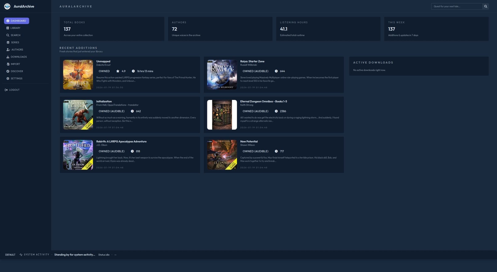
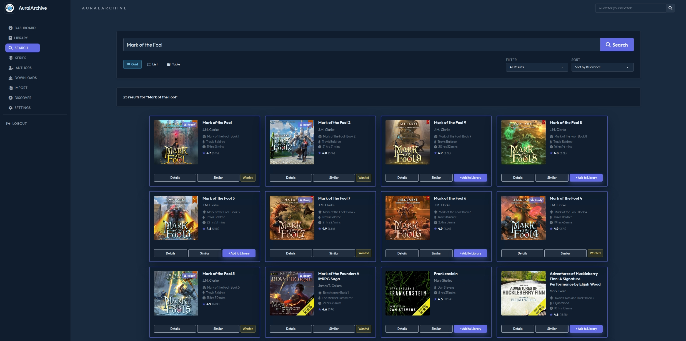
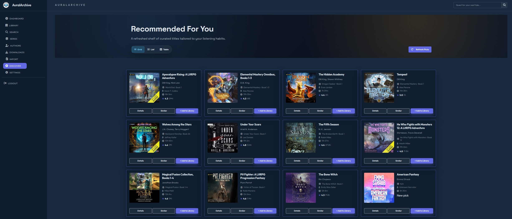
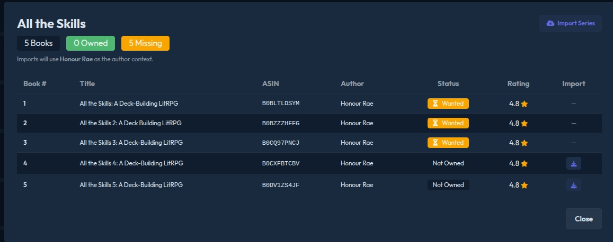

# AuralArchive Features

## Dashboard

The dashboard provides an at-a-glance view of your entire audiobook collection and recent activity.

## Discover

Find new audiobooks with personalized recommendations tailored to your listening habits.

Browse curated recommendations displayed in grid, list, or table views. Each book card shows cover art, title, author, series information, narrator, runtime, and rating. Quick-action buttons let you view details, find similar titles, or add directly to your library. Use the Refresh Page button to generate new recommendations based on your current collection and preferences.

## Search

Search to find audiobooks in seconds.

Enter a title, author, or series name to search for audiobooks galore. Results display in a grid with comprehensive metadata including cover art, series position, narrator, runtime, and community ratings. Each result shows its current status (Wanted, In Library, or available to add) with one-click actions to view details, discover similar books, or manage library status. Filter and sort options help narrow results by relevance or preference.

## Author Pages

Explore complete author catalogs with detailed statistics and series tracking.

Author pages display profile information, biographical details, and listening statistics. The Highlights section shows recent additions, discovery metadata, and most common narrators for that author. Catalogue Coverage breaks down total titles tracked, library percentage, and missing titles. Series Overview organizes all series by the author with book counts and import status, while standalone titles are listed separately. Additional features include importing entire series or the entire author catalog.

## Series Management

Track complete series with ownership status and one-click import capabilities.

Series modals display all books in order with detailed tracking. See at a glance how many books you own versus how many are missing. Each entry shows book number, full title, ASIN, author, ownership status (Owned, Not Owned, or Wanted), rating, and import options. Import entire series with a single click, automatically matching author context for proper organization.

## Indexer Integration

Connect to multiple indexers and direct download sources for comprehensive audiobook acquisition.

AuralArchive supports various popular indexers, allowing you to search across multiple sources simultaneously. Configure your preferred indexers through the settings interface with secure credential storage. The system intelligently queries all enabled sources and aggregates results for seamless browsing.

### Automatic Downloads

Enable automatic downloads to have AuralArchive monitor your library and automatically acquire books as they become available. The system evaluates all configured sources and selects the best available option based on quality, seeders, and availability. Set quality thresholds and download preferences to ensure you always get the format and quality you want.

### Audible Wishlist Integration

When Audible authentication is configured, AuralArchive automatically syncs with your Audible wishlist. Any title you add to your Audible wishlist will be automatically tracked in your AuralArchive library, allowing seamless management across both platforms. This integration ensures your wanted titles are consistently monitored regardless of where you add them.

## Key Features

### Library Organization
- Track ownership status across your entire collection
- Organize by author, series, or standalone titles

### Smart Discovery
- Personalized recommendations based on listening habits
- Multiple view modes (grid, list, table)
- Similar title suggestions for any book
- Refresh recommendations on demand

### Powerful Search
- Real-time results with rich metadata
- Status badges (Owned, Wanted, Available)
- Advanced filtering and sorting

### Author Tracking
- Complete author bibliographies
- Series and standalone organization
- Catalogue completion statistics
- Narrator tracking and preferences

### Series Completion
- Track ownership and missing books
- Bulk import entire series
- Author context matching
- Automatic ordering and sequencing
