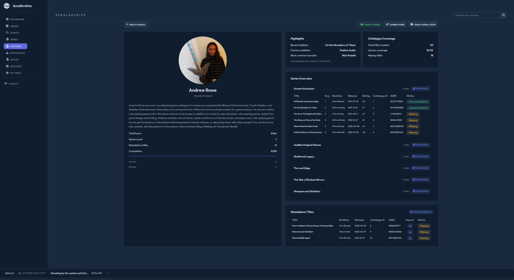
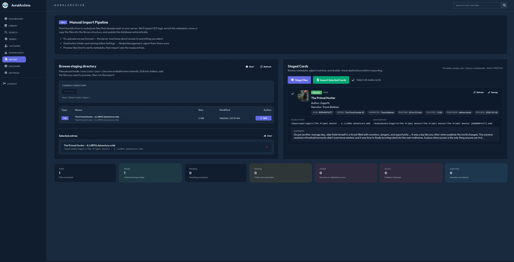

I would like to say I am a beginner with no experience and I have been teaching myself during this build. This project has taken many, many months. Things will break, things will have bugs. Things will get fixed. This is my first application and it is currently an Alpha build. Please have some patience. Thank you for your interest and please enjoy AuralArchive. 

# AuralArchive

**AuralArchive is a comprehensive audiobook library management and acquisition system designed to help you organize, discover, and manage your audiobook collection.**

Track your entire audiobook library with detailed metadata. Discover new titles with personalized recommendations. Search across multiple indexers to find and automatically download audiobooks. Integrate seamlessly with AudioBookShelf for organized library storage. Monitor your Audible wishlist for automatic tracking. All wrapped in a clean, modern web interface.

Whether you're managing hundreds of audiobooks or just getting started, AuralArchive provides the tools to keep your collection organized and growing.

---

## Features

## Dashboard

The dashboard provides an at-a-glance view of your entire audiobook collection and recent activity.


## Discover

Find new audiobooks with personalized recommendations tailored to your listening habits.


Browse curated recommendations displayed in grid, list, or table views. Each book card shows cover art, title, author, series information, narrator, runtime, and rating. Quick-action buttons let you view details, find similar titles, or add directly to your library. Use the Refresh Page button to generate new recommendations based on your current collection and preferences.

## Search

Search to find audiobooks in seconds.


Enter a title, author, or series name to search for audiobooks galore. Results display in a grid with comprehensive metadata including cover art, series position, narrator, runtime, and community ratings. Each result shows its current status (Wanted, In Library, or available to add) with one-click actions to view details, discover similar books, or manage library status. Filter and sort options help narrow results by relevance or preference.

## Author Pages

Explore complete author catalogs with detailed statistics and series tracking.



Author pages display profile information, biographical details, and listening statistics. The Highlights section shows recent additions, discovery metadata, and most common narrators for that author. Catalogue Coverage breaks down total titles tracked, library percentage, and missing titles. Series Overview organizes all series by the author with book counts and import status, while standalone titles are listed separately. Additional features include importing entire series or the entire author catalog.

## Series Management

Track complete series with ownership status and one-click import capabilities.


Series modals display all books in order with detailed tracking. See at a glance how many books you own versus how many are missing. Each entry shows book number, full title, ASIN, author, ownership status (Owned, Not Owned, or Wanted), rating, and import options. Import entire series with a single click, automatically matching author context for proper organization.

## AudioBookShelf Integration

Seamlessly connect AuralArchive with your AudioBookShelf server for unified audiobook management.

Configure your AudioBookShelf server connection through the settings interface with your server URL and API key. Once connected, AuralArchive can:

- **Library Sync** - Import your existing AudioBookShelf library into AuralArchive for tracking and management
- **Auto-Match** - Automatically match imported books with metadata from Audible and other sources
- **Organized Imports** - Send completed downloads directly to your AudioBookShelf library with proper file naming and structure
- **Configurable Naming** - Choose from multiple naming templates (simple, detailed, series-aware) to organize your library
- **Sync Scheduling** - Configure automatic sync intervals to keep libraries in sync

The integration ensures your AudioBookShelf library stays organized while AuralArchive handles acquisition, conversion, and metadata management.

**Initial Setup Tip:** After your first library sync from AudioBookShelf, perform a bulk metadata update in AuralArchive to enrich your library with comprehensive information from Audible and other sources. This ensures you have the most complete metadata, including series information, narrators, ratings, and descriptions.

## Import & Conversion

Advanced import capabilities with automatic format conversion for maximum compatibility.

### File Import



Import existing audiobook files into your library with intelligent processing:

- **Directory Monitoring** - Place audiobook files in your configured import directory for automatic processing
- **Format Support** - Handles M4B, MP3, and other common audiobook formats
- **Metadata Matching** - Automatically matches imported files with Audible metadata by ASIN or title
- **Smart Organization** - Files are organized into your library with proper naming and structure
- **Cleanup Options** - Configure whether to keep or remove source files after successful import

## Indexer and Download Client Integration

Connect to multiple indexers and direct download sources for comprehensive audiobook acquisition.

AuralArchive supports various popular indexers, allowing you to search across multiple sources simultaneously. Configure your preferred indexers through the settings interface with secure credential storage. The system intelligently queries all enabled sources and aggregates results for seamless browsing.

Current indexer application support is limited to Jackett for now. Direct Indexers are the preferred method. They are not dependent on supporting programs and have superior API communication for more reliable searches. Current download client support is limited to qBittorrent only. Support will be expanded over time for additional programs. 

### Automatic Downloads

Enable automatic downloads to have AuralArchive monitor your library and automatically acquire books as they become available. The system evaluates all configured sources and selects the best available option based on quality, seeders, and availability. Set quality thresholds and download preferences to ensure you always get the format and quality you want.

### Audible Wishlist Integration

When Audible authentication is configured, AuralArchive automatically syncs with your Audible wishlist. Any title you add to your Audible wishlist will be automatically tracked in your AuralArchive library, allowing seamless management across both platforms. This integration ensures your wanted titles are consistently monitored regardless of where you add them.

## Key Features

### Library Organization
- Track ownership status across your entire collection
- Organize by author, series, or standalone titles

### Smart Discovery
- Personalized recommendations based on listening habits
- Multiple view modes (grid, list, table)
- Similar title suggestions for any book
- Refresh recommendations on demand

### Powerful Search
- Real-time results with rich metadata
- Status badges (Owned, Wanted, Available)
- Advanced filtering and sorting

### Author Tracking
- Series and standalone organization
- Catalogue completion statistics
- Narrator tracking and preferences

### Series Completion
- Track ownership and missing books
- Bulk import entire series
- Author context matching
- Automatic ordering and sequencing

---

## Docker Deployment

Pull the image from GitHub Container Registry:

```bash
docker pull ghcr.io/thedragonshaman/auralarchive:latest
```

### Sample Docker Compose

Create a `docker-compose.yml` file:

```yaml
version: '3.8'

services:
  auralarchive:
    image: ghcr.io/thedragonshaman/auralarchive:latest
    container_name: auralarchive
    ports:
      - "8765:8765"
    volumes:
      - path-to-your-config:/config          # Configuration and database
      - path-to-your-downloads:/downloads    # Downloaded audiobooks
      - path-to-your-import:/import          # Import directory for processing
    environment:
      - PUID=1000                # User ID to run as (match your host user)
      - PGID=1000                # Group ID to run as (match your host user)
      - DOCKER_CONTAINER=true
      - TZ=America/New_York       # Set your timezone
      - ABS_SYNC_PAGE_SIZE=500    # AudioBookShelf sync pagination (default: 5 for testing, use 500+ for large libraries)
    restart: unless-stopped
```

Then start the container:

```bash
docker-compose up -d
```

Access the application at `http://localhost:8765`

**Volume Paths:**
- `/config` - Stores configuration files, Audible auth, and the SQLite database
- `/downloads` - Default location for downloaded audiobooks
- `/import` - Directory for importing existing audiobook files

**Environment Variables:**
- `PUID` - User ID to run as inside the container (default: 0/root). Set to your host user ID (usually 1000) to avoid permission issues
- `PGID` - Group ID to run as inside the container (default: 0/root). Set to your host group ID (usually 1000)
- `DOCKER_CONTAINER` - Set to `true` to enable Docker-specific paths
- `TZ` - Your local timezone (e.g., `America/New_York`)
- `ABS_SYNC_PAGE_SIZE` - Number of items to fetch per page when syncing from AudioBookShelf (default: 5 for testing, recommended 500+ for production libraries with 10,000+ items to avoid timeouts)
- `AURALARCHIVE_PORT` or `PORT` - Port to run the application on (default: 8765)
- `SOCKETIO_ASYNC_MODE` - SocketIO async mode (default: `eventlet`, options: `threading`, `eventlet`, `gevent`)

**Finding Your PUID and PGID (Linux/NAS):**
```bash
id your_username
# Example output: uid=1000(brandon) gid=1000(brandon)
# Use PUID=1000 and PGID=1000
```

You can customize download/import paths in the application settings after first launch.

---

## Credits & Acknowledgments

AuralArchive builds on fantastic open-source projects:
- **Audible by mkb79** — Core Audible download/auth foundation; thank you for making this possible.
- **LazyLibrarian** — Inspiration for handling indexers/clients and overall workflow patterns.
- **Readarr** — Influence on library organization, queue handling, and metadata flows.

---

## Disclaimer

**This software is intended solely for downloading your own legally owned titles and copyright-free or public domain audio content.**

This software is provided "AS IS," without warranty of any kind, either express or implied, including but not limited to the implied warranties of merchantability, fitness for a particular purpose, or non-infringement.

The developer(s) make no representations or warranties regarding the accuracy, functionality, reliability, or suitability of this software for any purpose.

You acknowledge and agree that you assume full responsibility for how you choose to use this software. The developer(s) are not responsible for any misuse of this software and do not endorse or condone copyright infringement or any illegal activity.

You are solely responsible for ensuring compliance with all applicable local, state, national, and international laws, including copyright laws and intellectual property rights, and for obtaining proper authorization before downloading any content.

The developer(s) shall not be held liable for any legal consequences, damages, losses, or claims arising from your use or misuse of this software.

By using this software, you acknowledge that you have read, understood, and agree to these terms, and you accept all risks associated with its use.

**USE AT YOUR OWN RISK.**
