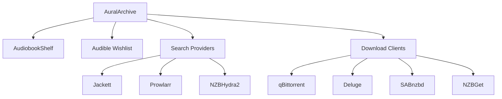

# AuralArchive

**Intelligent Audiobook Discovery & Management System**

AuralArchive is a self-hosted audiobook management and automation platform that intelligently discovers, organizes, and manages your audiobook collection with seamless AudiobookShelf integration.

[📖 Documentation](#installation) · [🚀 Quick Start](#installation) · [💬 Support](#support) · [🤝 Contributing](#contributing)

---

## Features

• **Smart Discovery** - Library-based recommendations and automated new release monitoring
• **Audible Wishlist Integration** - Automatic sync with one-click book additions  
• **AudiobookShelf Sync** - Bi-directional library synchronization with metadata enhancement
• **Automated Downloads** - Continuous searching with intelligent quality-based selection
• **Multi-Provider Search** - Integrates with Jackett, Prowlarr, and NZBHydra2
• **Download Client Support** - Works with popular torrent and NZB clients
• **Modern Web Interface** - Responsive design with real-time updates
• **Metadata Management** - Automatic cover art and book information enhancement

---

## How It Works

AuralArchive monitors your existing audiobook library to intelligently suggest new content. Simply add books to your Audible wishlist, and AuralArchive automatically searches across multiple providers, evaluates quality, and sends the best matches to your download client. Everything syncs seamlessly with AudiobookShelf for a complete audiobook management solution.

**Key Integrations:**
- AudiobookShelf (primary library management)
- Audible (wishlist sync and recommendations) 
- Download clients (qBittorrent, Deluge, Transmission, SABnzbd, NZBGet)
- Search providers (Jackett, Prowlarr, NZBHydra2)

---

## Installation

### Docker (Recommended)

```bash
docker run -d \
  --name auralarchive \
  -p 8080:8080 \
  -v /path/to/config:/config \
  -v /path/to/downloads:/downloads \
  --restart unless-stopped \
  auralarchive:latest
```

### Manual Installation

```bash
# Clone the repository
git clone https://github.com/TheDragonShaman/AuralArchive.git
cd AuralArchive

# Install dependencies
pip install -r requirements.txt

# Configure application
cp config/config.txt.example config/config.txt
# Edit config/config.txt with your settings

# Run the application
python app.py
```

Access the web interface at `http://localhost:8080`

---

## Configuration

### Essential Setup

1. **AudiobookShelf Connection**
   - Configure your AudiobookShelf server URL and API token
   - Select target library for synchronization

2. **Download Client**
   - Connect your preferred torrent/NZB client
   - Configure download directories

3. **Search Providers**
   - Add Jackett, Prowlarr, or NZBHydra2 instances
   - Configure API keys and indexers

4. **Audible Integration** (Optional)
   - Link your Audible account for wishlist sync
   - Enable automatic monitoring

### Configuration File

Edit `config/config.txt` with your service details:

```ini
[AUDIOBOOKSHELF]
URL=http://localhost:13378
TOKEN=your_api_token
LIBRARY_ID=your_library_id

[DOWNLOAD_CLIENT]
TYPE=qbittorrent
HOST=localhost
PORT=8080
USERNAME=admin
PASSWORD=password

[JACKETT]
URL=http://localhost:9117
API_KEY=your_jackett_api_key
```

See the [Configuration Guide](docs/configuration.md) for complete setup details.

---

## Usage

### Automated Workflow

1. **Initial Setup**: AuralArchive imports your existing AudiobookShelf library
2. **Discovery**: The system analyzes your collection and suggests new books
3. **Wishlist Sync**: Add books to your Audible wishlist for automatic processing
4. **Search & Download**: AuralArchive searches providers and queues downloads
5. **Library Sync**: New books automatically appear in AudiobookShelf

### Manual Management

- **Library View**: Browse your complete collection with metadata and cover art
- **Discover Section**: Find recommendations based on your reading patterns
- **Downloads**: Monitor active downloads and search progress
- **Settings**: Configure providers, preferences, and automation intervals

---

## System Architecture



---

## Contributing

AuralArchive is built with Python and Flask. Contributions are welcome!

### Development Setup

```bash
# Clone and setup development environment
git clone https://github.com/TheDragonShaman/AuralArchive.git
cd AuralArchive

# Create virtual environment
python -m venv venv
source venv/bin/activate  # Linux/Mac
venv\Scripts\activate     # Windows

# Install dependencies
pip install -r requirements.txt

# Run in development mode
python app.py
```

### Development Workflow

- **Development**: Work on the `dev` branch for new features
- **Testing**: Ensure all functionality works with your changes
- **Pull Requests**: Submit PRs to the `dev` branch
- **Releases**: Stable releases are merged to `main`

See [DEVELOPMENT.md](DEVELOPMENT.md) for detailed contribution guidelines.

---

## Support

**Need Help?**
- [GitHub Issues](https://github.com/TheDragonShaman/AuralArchive/issues) - Bug reports and feature requests
- [Documentation](https://github.com/TheDragonShaman/AuralArchive/wiki) - Detailed setup and usage guides
- [Discussions](https://github.com/TheDragonShaman/AuralArchive/discussions) - Community support and questions

---

## License

This project is licensed under the GNU General Public License v3.0 - see the [LICENSE](LICENSE) file for details.

---

## Acknowledgments

Special thanks to:
- [AudiobookShelf](https://github.com/advplyr/audiobookshelf) - Primary integration and inspiration
- [Jackett](https://github.com/Jackett/Jackett) - Torrent indexer aggregation
- [Prowlarr](https://github.com/Prowlarr/Prowlarr) - Indexer management
- The open source community for tools and libraries that make this project possible
